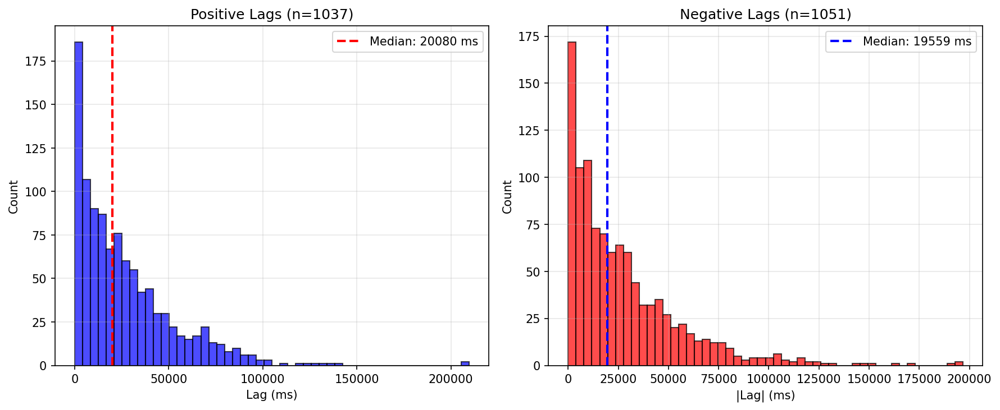
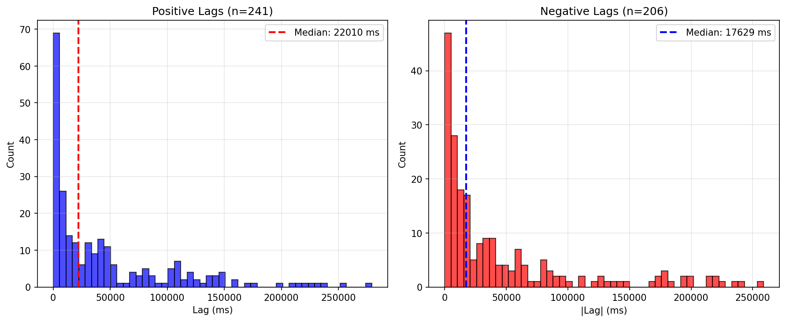
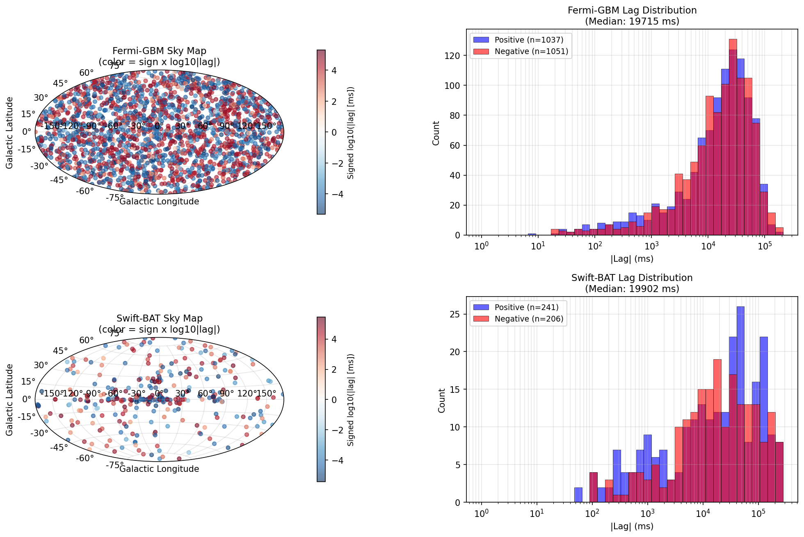
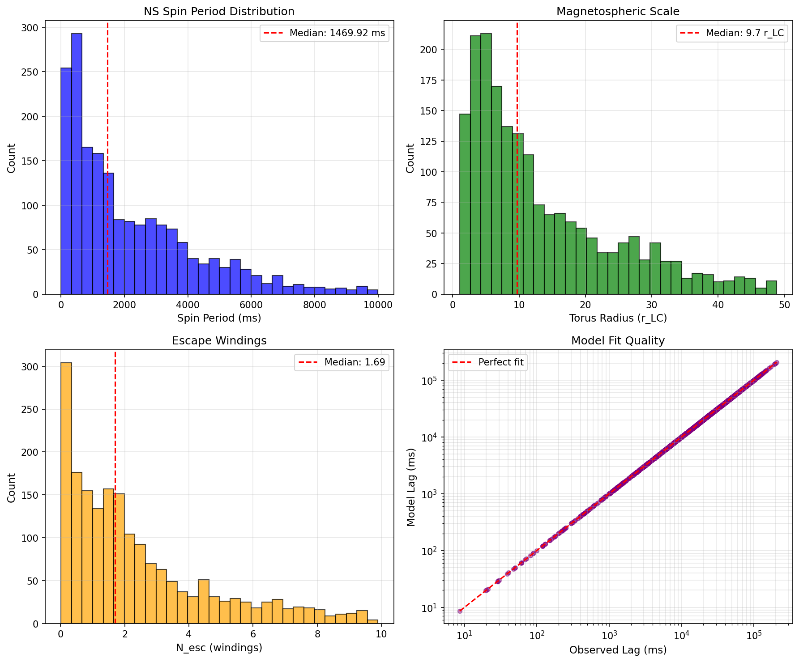
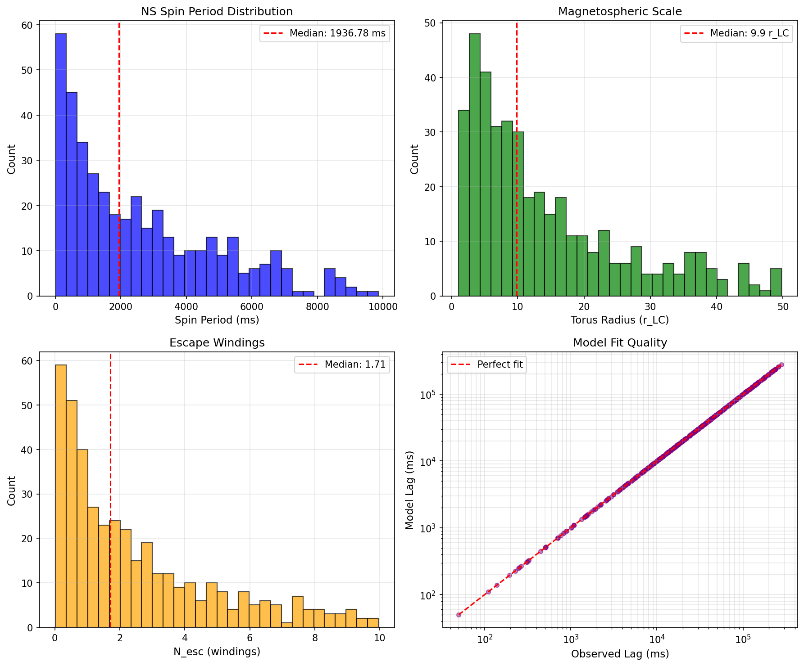

# GRB Spectral Lag Catalog and Analysis

This repository contains the processed Fermi/GBM and Swift/BAT spectral-lag catalogs and the Python scripts used to reproduce the statistical analysis and figures for the manuscript.

Raw NASA event files are not included. They can be downloaded again with the optional downloader scripts, but the main analysis starts from the processed CSV catalogs included here.

## Current Catalogs

| Instrument | Measured lags | Significant positive | Significant negative | Consistent with zero |
| --- | ---: | ---: | ---: | ---: |
| Fermi/GBM | 2128 | 1037 | 1051 | 40 |
| Swift/BAT | 3157 | 241 | 206 | 2710 |

Duration metadata are included where matched to the public mission catalogs. Fermi/GBM has complete `T90` coverage in the processed table. Swift/BAT has partial `T90` coverage because not every locally processed event has a matching row in the public BAT summary table.

## Figures











## Repository Contents

```text
.
├── fermi_full_data.csv
├── swift_full_data.csv
├── config.py
├── reporting.py
├── grb_lag_common.py
├── run_pipeline.py
├── fermi_preprocessing.py
├── swift_preprocessing.py
├── fermi_add_metadata.py
├── swift_add_metadata.py
├── run_analysis.py
├── run_parameter_inversion.py
├── run_magnetic_flow_calculation.py
├── fermi_download.py
├── swift_download.py
├── figures/
└── requirements.txt
```

Shared constants live in `config.py`, shared printing helpers in `reporting.py`, and shared lag-estimation utilities in `grb_lag_common.py`. Instrument-specific scripts remain flat command-line programs so the workflow is easy to reproduce without installing a package.

## Installation

Python 3.10 or newer is recommended.

```bash
pip install -r requirements.txt
```

Fermi preprocessing uses `gbm-data-tools`. On some Windows systems this dependency is easier to run from WSL/Linux. The already processed `fermi_full_data.csv` does not require rerunning Fermi preprocessing.

## Reproduce Analysis From Included CSVs

The recommended entrypoint starts from the included processed CSVs:

```bash
python run_pipeline.py
```

This validates both catalogs, runs the statistical analysis, and regenerates the main figures.

Run the same workflow plus the illustrative parameter inversion:

```bash
python run_pipeline.py --with-inversion
```

Run only the statistical analysis and regenerate the main figures:

```bash
python run_analysis.py
```

Run the illustrative neutron-star transport parameter inversion:

```bash
python run_parameter_inversion.py
```

These commands read `fermi_full_data.csv` and `swift_full_data.csv` and write plots into `figures/`.

`run_magnetic_flow_calculation.py` is a supplementary theory-side calculation script. It is not required for regenerating the processed catalogs or the main statistical figures.

## Optional Full Reprocessing

The raw mission files are large and are intentionally excluded from the repository. To rebuild the catalogs from raw public data, run the workflow below after downloading the raw files.

Download raw files:

```bash
python fermi_download.py
python swift_download.py
```

Preprocess event data into lag catalogs:

```bash
python fermi_preprocessing.py
python swift_preprocessing.py
```

Add public catalog metadata:

```bash
python fermi_add_metadata.py
python swift_add_metadata.py
```

Then rerun:

```bash
python run_pipeline.py --with-inversion
```

The same full rebuild can be launched as:

```bash
python run_pipeline.py --with-preprocessing
```

To also fetch raw public files first:

```bash
python run_pipeline.py --download
```

## Notes On Significance And Spatial Tests

The full measured catalogs retain events with lags consistent with zero. The positive/negative population fractions are reported for the uniformly defined significant-lag subset, using `lag_significance >= 2`.

Directional tests in `run_analysis.py` are empirical null checks for large-scale systematics. The script reports raw p-values and Bonferroni-adjusted p-values for the directional test family.

## Data Columns

Both public CSV catalogs use the same schema:

```text
instrument, filename, grb_name, grb_time_utc, ra, dec,
lag_ms, lag_error, lag_significance, is_significant,
lag_type, lag_class, t90_s, t90_error_s, t50_s,
t50_error_s, duration_class
```
